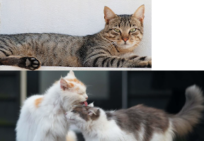

# join-images-sharp
Join (composite) images together automatically

 +

=


## Motivation
Needed a compact, but configurable image join utility, which I decided to open source as I like the code so much

## Installation
`npm i join-images-sharp`

or

`pnpm add join-images-sharp`

or

`yarn add join-images-sharp`

## Usage
```typescript
import joinImages from "join-images-sharp";

await joinImages([
    'test-images/landscape-1.png',
    'test-images/landscape-2.png',
], 'test-images-output/output.png');
```

Image formats can be JPEG, PNG, WebP, AVIF, GIF, SVG or TIFF and can be mixed and matched, eg, you can input 1 image as gif, another as jpeg and output in png.

By default, the images will join along the longest edge (as determined by `isVertical = maxWidth > maxHeight`), where max* is from the biggest image

You can join along the shortest edge by setting `options.direction` to `auto-reverse`, or use `vertical` or `horizontal` to set which direction to use manually:

```typescript
import joinImages, { JoinImageDirection } from "join-images-sharp";

await joinImages([
    'test-images/landscape-1.png',
    'test-images/landscape-2.png',
], 'test-images-output/output.png', { direction: JoinImageDirection.AutoReverse }); // or 'auto-reverse'
// or JoinImageDirection.Vertical or 'vertical'
// or JoinImageDirection.Horizontal or 'horizontal'
```

You can set the background color to use for any blank areas:

```typescript
import joinImages from "join-images-sharp";

await joinImages([
    'test-images/landscape-1.png',
    'test-images/landscape-2.png',
], 'test-images-output/output.png', { background: { alpha: 0, b: 255, g: 255, r: 255 } });
// or hex
], 'test-images-output/output.png', { background: '#00FF00' });
```

## API
| Option               | Type                                                                       | Description                                                                                                                                                                                                                                                                                                                                                                                       |
|----------------------|----------------------------------------------------------------------------|---------------------------------------------------------------------------------------------------------------------------------------------------------------------------------------------------------------------------------------------------------------------------------------------------------------------------------------------------------------------------------------------------|
| `input`              | `string[]`                                                                 | Array of image paths to join                                                                                                                                                                                                                                                                                                                                                                      |
| `output`             | `string`                                                                   | Output path to save composited image                                                                                                                                                                                                                                                                                                                                                              |
| `options.direction`  | `string` \| `JoinImageDirection`                                           | Direction in which to join the images. Defaults to `auto`.<br/><br/>  `JoinImageDirection.Auto` \| `auto` > Join along the longest edges<br/> `JoinImageDirection.AutoReverse` \| `auto-reverse` > Join along the shortest edges<br/> `JoinImageDirection.Vertical` \| `vertical` > Stack images vertically<br/> `JoinImageDirection.Horizontal` \| `horizontal` > Stack images horizontally<br/> |
| `options.background` | `string`<br/> or<br/> `{ alpha: number, b: number, g: number, r: number }` | Background color to use for blank areas.<br/> Defaults to transparent for supporting formats (png, webp, etc), or white for other formats (jpeg, etc)<br/><br/>  Hex string or a rgba object                                                                                                                                                                                                      |

## Licence
[ISC](https://opensource.org/license/isc-license-txt)

## Author(s)
- David Wakelin (https://davidwakelin.co.uk)
